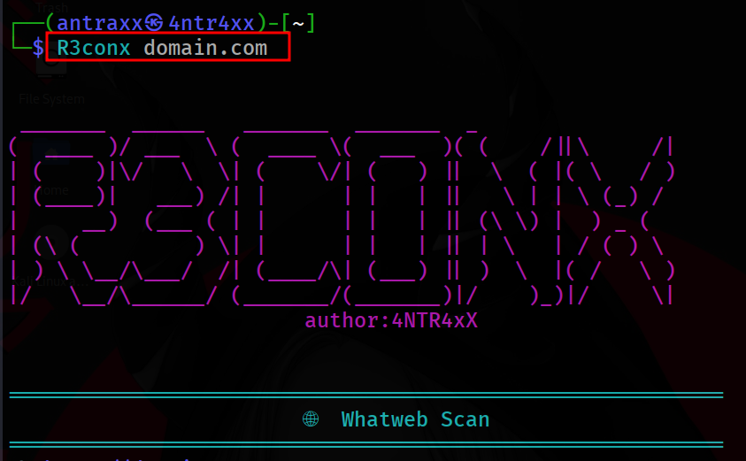

# R3conx: Reconocimiento en Dominios



R3conX es una herramienta de línea de comandos (CLI) escrita en Bash, diseñada para automatizar el reconocimiento de seguridad en dominios web. 
Su propósito principal es facilitar y acelerar las fases iniciales del pentesting, recopilando información crítica del objetivo sin intervención manual constante.

- Aprovecha diversas herramientas reconocidas en la comunidad para obtener datos como:

- Detalles del servidor web

- Detección de balanceadores de carga

- Identificación de firewalls de aplicaciones web (WAF)

- Análisis de certificados SSL/TLS

- Enumeración de subdominios

- Recolección de correos electrónicos públicos vinculados al dominio

**🔍 ¿Por qué es útil para pentesters?**
Ahorra tiempo en tareas repetitivas al automatizar procesos clave de reconocimiento.

- Centraliza información esencial del objetivo en un solo reporte fácil de leer.

- Detecta tecnologías de defensa, como WAF o load balancers, que pueden afectar la estrategia del pentest.

- Ayuda a perfilar la infraestructura del objetivo para planificar ataques más eficaces.

- Fácil de usar y portable, sin dependencias pesadas; ideal para entornos Unix-like.

- **Herramienta de reconocimiento pasivo y activo para pentesters**.

## Características

- **WhatWeb**: Detecta tecnologías y servicios asociados al dominio.
- **Load Balancer Detection**: Detecta si el dominio está detrás de un balanceador de carga.
- **WAF Detection**: Identifica si un firewall de aplicaciones web (WAF) está protegiendo el dominio.
- **SSL/TLS Analysis**: Analiza los certificados SSL/TLS del dominio.
- **Subdominios**: Encuentra subdominios asociados al dominio.
- **Correo Electrónico**: Obtiene correos electrónicos asociados con el dominio mediante `theHarvester`.

## Requisitos

Antes de usar la herramienta, asegúrate de tener las siguientes herramientas instaladas:

- **WhatWeb**: [https://github.com/urbanadventurer/whatweb](https://github.com/urbanadventurer/whatweb)
- **lbd (Load Balancer Detection)**: [https://github.com/gamelinux/lbd](https://github.com/gamelinux/lbd)
- **wafw00f**: [https://github.com/EnableSecurity/wafw00f](https://github.com/EnableSecurity/wafw00f)
- **sslyze**: [https://github.com/nabla-c0d3/sslyze](https://github.com/nabla-c0d3/sslyze)
- **sublist3r**: [https://github.com/aboul3la/Sublist3r](https://github.com/aboul3la/Sublist3r)
- **theHarvester**: [https://github.com/larose/theHarvester](https://github.com/larose/theHarvester)

Puedes instalar estas herramientas en un sistema basado en Debian/Ubuntu con los siguientes comandos:

```bash
sudo apt update
sudo apt install whatweb lbd wafw00f sslyze sublist3r theHarvester
```

## Instalación

```bash
git clone https://github.com/4NTR4xX01/R3conX.git
chmod +x R3conx
sudo mv R3conx /usr/local/bin/

```
## Uso


```bash
R3conx dominio.com
```

